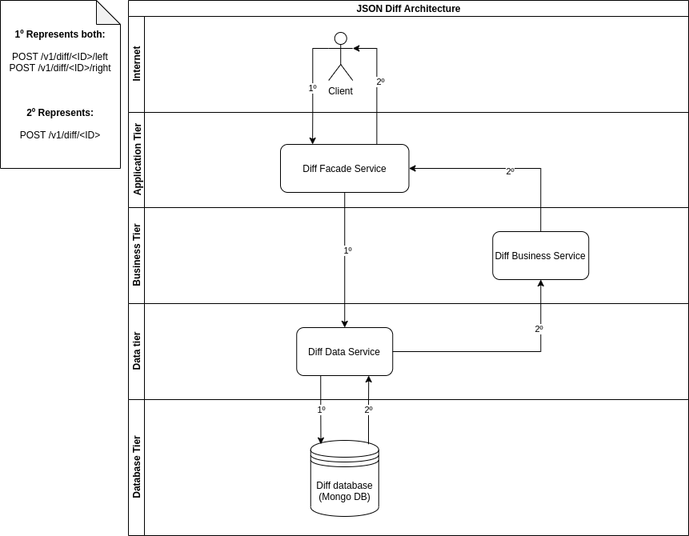

# json-diff-service
JSON Base64 comparator

## Travis Builds (Continuous Integration)
| Type          | Status                                                   | Description                    |
|:--------------|:---------------------------------------------------------|:-------------------------------|
| Maven         | [](https://travis-ci.org/thiagoteixeira/json-diff-service)              | mvn clean verify sonar:sonar |

## SonarCloud analysis for json-diff-service project (Continuous Code Quality)

[![sonar-quality-gate][sonar-quality-gate]][sonar-url]
[![sonar-coverage][sonar-coverage]][sonar-url]
[![sonar-bugs][sonar-bugs]][sonar-url]
[![sonar-vulnerabilities][sonar-vulnerabilities]][sonar-url]

## System Architecture
### Diagram

### [Diff Data Service](#diff-data-service---api-resources)
Represents the microservice that will handle the JSON entity's persistence.
### [Diff Business Service](#diff-business-service---api-resources)
Represents the microservice that will implement all business rules to execute the JSON sides data comparison, it will handle HTTP calls to diff-data-service to retrieve the JSON entity before the data comparison.
### [Diff Facade Service](#diff-facade-service---api-resources)
This represents a facade microservice that will orchestrate calls to the Business and Data tier microservices to insert, update or compare data from their respective entities.

<br/>

## Diff Facade Service - API Resources

  - [POST /v1/diff/{id}/left](#post-facade-hostv1diffidleft)
  - [POST /v1/diff/{id}/right](#post-facade-hostv1diffidright)
  - [GET /v1/diff/{id}](#get-facade-hostv1diffid)

### POST {facade-host}/v1/diff/{id}/left

Example: http://localhost:8080/v1/diff/1/left
```
curl --location --request POST 'localhost:8080/v1/diff/1/left' \
--header 'Content-Type: application/json' \
--data-raw '{
  "value":"eyAibmFtZSI6IlRoaWFnbyBUZWl4ZWlyYSIgfQ=="
}'
```
Note: Request body value represents the JSON base64 encoded binary data, the real JSON value is `{ "name":"Thiago Teixeira" }`

The response body will be like that:
```
{
    "id": 1,
    "left": "eyAibmFtZSI6IlRoaWFnbyBUZWl4ZWlyYSIgfQ==",
    "right": null
}
```

### POST {facade-host}/v1/diff/{id}/right

Example: http://localhost:8080/v1/diff/1/right
```
curl --location --request POST 'localhost:8080/v1/diff/1/right' \
--header 'Content-Type: application/json' \
--data-raw '{
  "value":"eyAibmFtZSI6IlRoaWFnbyBUZWl4ZWlyYSIgfQ=="
}'
```
Note: Request body value represents the JSON base64 encoded binary data, the real JSON value is `{ "name":"Thiago Teixeira" }`

The response body will be like that:
```
{
    "id": 1,
    "left": "eyAibmFtZSI6IlRoaWFnbyBUZWl4ZWlyYSIgfQ==",
    "right": "eyAibmFtZSI6IlRoaWFnbyBUZWl4ZWlyYSIgfQ=="
}
```

### GET {facade-host}/v1/diff/{id}

Example: http://localhost:8080/v1/diff/1
```
curl --location --request GET 'localhost:8080/v1/diff/22' \
--header 'traceId: test-thiago-teixeira-01' \
--header 'Accept-Language: en'
```
Response body:
```
{
    "message": "The JSON contents are equal!"
}
```
Note: result when both sides are equal! 

#### Possible message results when 'Accept-Language' header is:
##### Empty or 'en' or any other language different from 'pt' and 'es'
| When      | Message in response body will be | HTTP Status Code | Note |
|:--------------|:----------------------------------|----------------------|-----|
| `Sides are equal`      |    `The JSON contents are equal!` |200 OK||
| `Sides have not the same size`      |    `The JSON contents have not the same size!` |200 OK||
| `Sides have the same size, but different bytes`  |    `The JSON contents have the same size, but offsets are different: 19` | 200 OK | In this case, 19 is the only different position|
| The {id} path variable is not found in json-diff-data microservice |  | 404 Not Found ||

##### 'pt' (PORTUGUESE)
| When      | Message in response body will be | HTTP Status Code | Note |
|:--------------|:----------------------------------|----------------------|-----|
| `Sides are equal`      |    `Os conteúdos JSON são iguais!` |200 OK||
| `Sides have not the same size`      |    `Os conteúdos JSON não possuem o mesmo tamanho!` |200 OK||
| `Sides have the same size, but different bytes`  |    `Os conteúdos JSON possuem o mesmo tamanho, mas os deslocamentos são diferentes: 19` | 200 OK | In this case, 19 is the only different position|
| The {id} path variable is not found in json-diff-data microservice |  | 404 Not Found ||
##### 'es' (SPANISH)
| When      | Message in response body will be | HTTP Status Code | Note |
|:--------------|:----------------------------------|----------------------|-----|
| `Sides are equal`      |    `¡Los contenidos JSON son iguales!` |200 OK||
| `Sides have not the same size`      |    `¡Los contenidos JSON no tienen el mismo tamaño!` |200 OK||
| `Sides have the same size, but different bytes`  |    `El contenidos JSON tiene el mismo tamaño, pero las compensaciones son diferentes: 19` | 200 OK | In this case, 19 is the only different position|
| The {id} path variable is not found in json-diff-data microservice |  | 404 Not Found ||

## Diff Business Service - API Resources
  - [GET /v1/diff/{id}](#get-business-hostv1diffid)

### GET {business-host}/v1/diff/{id}

Example: http://localhost:8081/v1/diff/1
```
curl --location --request GET 'localhost:8081/v1/diff/1' \
--header 'traceId: test-thiago-teixeira-01'
```
Response body:
```
{
    "id": 1,
    "left": "eyAibmFtZSI6IlRoaWFnbyBUZWl4ZWlyYSIgfQ==",
    "right": "eyAibmFtZSI6IlRoaWFnbyBUZWl4ZWlyYSIgfQ=="
}
```

## Diff Data Service - API Resources

  - [POST /v1/diff/{id}/left](#post-data-hostv1diffidleft)
  - [POST /v1/diff/{id}/right](#post-data-hostv1diffidright)
  - [GET /v1/diff/{id}](#get-data-hostv1diffid)

### POST {data-host}/v1/diff/{id}/left

Example: http://localhost:8082/v1/diff/1/left
```
curl --location --request POST 'localhost:8082/v1/diff/1/left' \
--header 'Content-Type: application/json' \
--data-raw '{
  "value":"eyAibmFtZSI6IlRoaWFnbyBUZWl4ZWlyYSIgfQ=="
}'
```
Note: Request body value represents the JSON base64 encoded binary data, the real JSON value is `{ "name":"Thiago Teixeira" }`

The response body will be like that:
```
{
    "id": 1,
    "left": "eyAibmFtZSI6IlRoaWFnbyBUZWl4ZWlyYSIgfQ==",
    "right": null
}
```

### POST {data-host}/v1/diff/{id}/right

Example: http://localhost:8082/v1/diff/1/right
```
curl --location --request POST 'localhost:8082/v1/diff/1/right' \
--header 'Content-Type: application/json' \
--data-raw '{
  "value":"eyAibmFtZSI6IlRoaWFnbyBUZWl4ZWlyYSIgfQ=="
}'
```
Note: Request body value represents the JSON base64 encoded binary data, the real JSON value is `{ "name":"Thiago Teixeira" }`

The response body will be like that:
```
{
    "id": 1,
    "left": "eyAibmFtZSI6IlRoaWFnbyBUZWl4ZWlyYSIgfQ==",
    "right": "eyAibmFtZSI6IlRoaWFnbyBUZWl4ZWlyYSIgfQ=="
}
```

### GET {data-host}/v1/diff/{id}

Example: http://localhost:8082/v1/diff/1
```
curl --location --request GET 'localhost:8082/v1/diff/1' \
--header 'traceId: test-thiago-teixeira-01'
```
Response body:
```
{
    "id": 1,
    "left": "eyAibmFtZSI6IlRoaWFnbyBUZWl4ZWlyYSIgfQ==",
    "right": "eyAibmFtZSI6IlRoaWFnbyBUZWl4ZWlyYSIgfQ=="
}
```

[sonar-url]:https://sonarcloud.io/dashboard?id=com.thiagoteixeira%3Ajson-diff-service-parent&nocache
[sonar-quality-gate]: https://sonarcloud.io/api/project_badges/measure?project=com.thiagoteixeira%3Ajson-diff-service-parent&metric=alert_status
[sonar-coverage]: https://sonarcloud.io/api/project_badges/measure?project=com.thiagoteixeira%3Ajson-diff-service-parent&metric=coverage&cached=1
[sonar-bugs]: https://sonarcloud.io/api/project_badges/measure?project=com.thiagoteixeira%3Ajson-diff-service-parent&metric=bugs
[sonar-vulnerabilities]: https://sonarcloud.io/api/project_badges/measure?project=com.thiagoteixeira%3Ajson-diff-service-parent&metric=vulnerabilities
